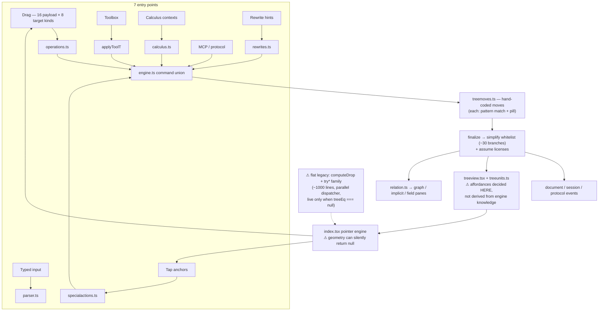

# Architecture review — why the edge cases keep coming, and what the field already knows

Written after six consecutive rounds of edge-case fixes (missing tap anchors,
hit-box gaps, `2^x/2^x` refusing to cancel, ln sealing a whole side, contour
holes). The question this document answers: **do the recurring edge cases mean
the architecture fails to capture intuitive mathematical workflows — and what
do sixty years of computer-algebra research say we should do about it?**

## The answer in one paragraph

Richardson's theorem (1968) proves that deciding whether an expression built
from integers, π, `exp`, and `sin` equals zero is **undecidable** — there is
provably no algorithm that handles all cases. Every real CAS (Mathematica,
Maple, SymPy) therefore ships an ever-growing set of heuristic rules, forever.
So "why so many edge cases" has a mathematical answer: **they are intrinsic to
the domain, not a symptom of a broken design.** The architectural question is
narrower and more useful: *does handling a newly discovered case cost O(1) —
adding a rule row — or O(n) — writing and wiring a new code path?* Today this
codebase pays O(n) in three specific places, and all eight recent fix-commits
landed in exactly those places. None landed in the semantic core.

## The current workflow

Census (verified against source):

- 7 operation entry points; the drag grammar alone spans **16 `DragPayload`
  kinds × 8 `DropTarget` kinds** (`operations.ts`).
- `simplifyPass` holds **~30 hand-justified whitelist branches** (pow ≈ 11,
  mul ≈ 8) — the densest special-casing in the codebase.
- **~35–40 pattern-match refusal sites** across the tree layers
  (`operations.ts`, `specialactions.ts`, `treemoves.ts`, `calculus.ts`,
  `parser.ts`) plus **7 opaque-wrap fallbacks** (unmatched shape sealed under
  a wrapper node with a pill).
- A **~1000-line frozen flat-model dispatcher** (`computeDrop` + the `try*`
  family in `index.tsx`, with ~15 more refusal strings) still runs whenever
  `treeEq === null`, bridged by `flatToTree`/`treeSideToFlat` in `commitMove`.

## What the fix history actually says

Eight recent fix-commits, categorized:

| Hole category | Commits | Layer |
|---|---|---|
| Whitelist rules giving up on partial matches | power merging, ln distribution | simplifier / move layer |
| Render-layer affordance gaps | `2^x` had no anchor; exponent surfaces missing | treeview anchors |
| Hit-testing / geometry silent-nulls | drop dead-zone, preview overlay swallowing taps, `pointer-events-none` poke | pointer layer |
| Gesture / tap wiring | Operations-menu taps, contextual term taps | index / operations |
| Animation identity | tree-id aliasing morphs | replay engine |

**Zero fixes were semantic-engine correctness bugs.** The pill discipline and
the property fuzzer (5,600+ value checks per run) have held throughout. The
edge cases live at the *edges* — where shapes meet pattern matches, and where
pixels meet affordances — not in the algebra.

## What the literature says

1. **Richardson's theorem** — zero-equivalence with `exp`/`sin`/π is
   undecidable; conservative, assumption-guarded simplification is the correct
   response, not a workaround.
   ([Wikipedia](https://en.wikipedia.org/wiki/Richardson%27s_theorem))
2. **Term rewriting & canonical forms** — the classical CAS architecture is a
   *database of rewrite rules* plus canonical forms per expression class.
   Destructive rewriting is **rule-ordering sensitive**: applying one rewrite
   can permanently hide another — exactly the `(2^x)^(−1)` never meeting
   `2^x` bug class we hit.
3. **Equality saturation / e-graphs** (egg, 2021) — the modern cure for rule
   ordering: apply all rules non-destructively over an e-graph of equivalent
   forms, extract the best at the end. Overkill at this tool's scale, but its
   core lesson transfers directly: **rules are data consumed by one engine,
   not hand-wired code paths.**
   ([egg paper](https://arxiv.org/pdf/2004.03082))
4. **SymPy's assumptions system** — "never simplify unless the assumptions
   allow it; symbols are general until declared otherwise." This is precisely
   the pill/`assume` design this project converged on independently. The
   literature's refinement: make assumptions **per-symbol domain facts**
   (positive, nonzero, integer) that rules query — richer than the current
   ad-hoc `nonzeroNode`.
   ([SymPy docs](https://docs.sympy.org/latest/guides/assumptions.html))
5. **Graspable Math** (Ottmar & Landy) — the direct academic prior art for
   gesture-driven algebra. Its key design: gestures and their visual
   affordances are **derived from the rewrite-rule database**, so a rule added
   once is automatically draggable/tappable everywhere it applies.
   ([MAPLE Lab](https://www.ottmarmaplelab.com/research/graspable-math))
6. **MLIR Declarative Rewrite Rules** — production-compiler precedent for
   table-driven rules with generated matchers.
   ([MLIR DRR](https://mlir.llvm.org/docs/DeclarativeRewrites/))
7. **Interval-arithmetic implicit plotting** (Snyder '92, Tupper '01) —
   sampling contours (marching squares) is known-unsound; interval methods
   give guaranteed topology. The pragmatic fixes shipped (corner dedupe,
   higher resolution, polyline chaining) are fine; interval arithmetic is the
   principled upgrade if artifacts recur.

## The verdict

The **semantic core is architecturally right.** The expression tree, the
whitelist simplifier restricted to unconditional identities, and conditional
rewrites as player moves with typed pills — that is CAS best practice,
independently reinvented, and both Richardson and SymPy say the conservatism
should stay.

The edge-case *factory* is three structural facts around that core:

1. **Rules are code, not data.** Every operation is a bespoke function with
   its own pattern match. An unknown sub-shape triggers a wholesale bail-out
   (the "local-reasoning holes"), and each newly discovered case costs a new
   code path, new wiring, and new tests — O(n) forever.
2. **Affordances are not derived from engine knowledge.** `treeview.tsx`
   independently re-decides which glyph offers which anchor. The engine can
   know an operation is legal while the UI never offers it — every missing
   anchor this month was this disconnect. Graspable Math's published design
   derives affordances *from* the rule set; ours re-implements them by hand.
3. **A frozen parallel model doubles the surface.** The flat-model dispatcher
   duplicates move logic and refusals for a shrinking input class, and the
   flat↔tree bridge in `commitMove` is a standing source of subtle state
   divergence.

## Recommendation (phased)

All three phases have shipped: Phase A is `registry.ts` + the derivation
invariant (test-registry), Phase B deleted the flat runtime (legacy `?eq=`
links convert inside `decodeHistory`; `treeEq` is non-null by construction),
and Phase C is `facts.ts` + the engine's standing-facts pass (test-facts):
history pills and human-declared symbol-book facts parse back into
simplifier licenses applied to every command result.

- **Phase A — operations registry** (highest leverage). One table enumerating
  every legal operation: `{pattern, rewrite, license/pill, gesture binding,
  anchor spec, label}`. The engine executes rows; `listApplicableOperations`
  (which already half-exists for the protocol) and the anchor layer both
  **derive from the same rows**. A new case becomes a new row plus tests —
  O(1). This is the Graspable-Math/MLIR pattern at this codebase's scale.
- **Phase B — retire the flat model.** Convert at the boundary via
  `flatToTree`, delete `computeDrop` + the `try*` family (~1000 lines, ~15
  refusal sites). The roadmap already declares flat frozen; keeping it live
  doubles every audit.
- **Phase C — deepen assumptions** (opportunistic). Grow the `assume`
  mechanism toward SymPy-style per-symbol domain facts (positive / nonzero /
  integer) stored in the symbol book and queried by simplifier rules, instead
  of the pointwise `nonzeroKeys` plumbing.

**Explicitly rejected**: an e-graph rewrite of the engine (wrong scale for a
teaching tool; ordering bugs are cheaper to kill with the registry), and any
loosening of the whitelist (Richardson says the conservatism is the design,
not a limitation).

## How to use this document

Before adding the next operation or fixing the next "why doesn't it…" report,
ask which of the three structural facts produced it — then prefer the fix that
moves the system toward the registry (a rule row, a derived affordance, one
model) over another hand-wired special case.
